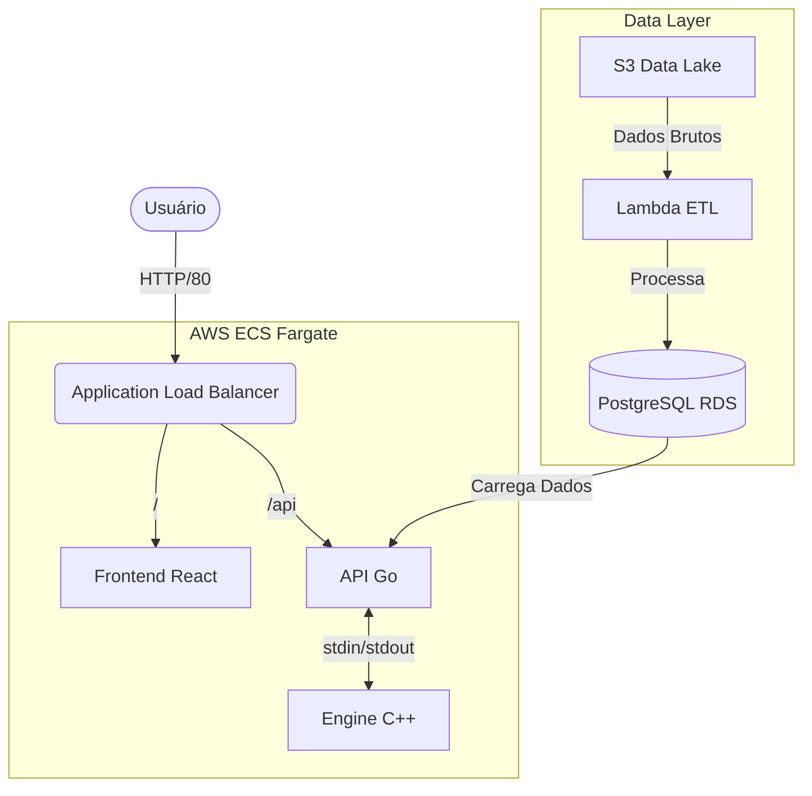

# Nexus SUS Log Engine 🏥🚀

**Nexus SUS** é um sistema de alta performance para ingestão, processamento e visualização de indicadores de saúde do SUS (Sistema Único de Saúde). O projeto utiliza uma arquitetura moderna com **Go**, **C++**, **React**, **AWS Fargate** e **Terraform**.

---

## 🏗️ Arquitetura

O sistema é composto por 4 módulos principais operando na AWS:

1.  **ETL Pipeline (Python/AWS Lambda):** Extrai dados brutos do Data Lake (S3), processa e carrega no banco de dados.
2.  **Core Engine (C++):** Motor de alta performance para indexação e consultas rápidas em memória (Hash Tables & B-Trees).
3.  **API Gateway (Go):** API REST que interage com o Engine e o Banco de Dados.
4.  **Frontend (React/Vite):** Interface de usuário para visualização dos dados.



---

## 📂 Estrutura do Projeto

| Diretório | Descrição | Tecnologias |
| :--- | :--- | :--- |
| `api/` | API REST principal. Gerencia conexões e o Engine. | **Go (Golang)** |
| `nexus-sus-engine/` | Motor de busca e estrutura de dados em memória. | **C++ (GCC)** |
| `nexus-sus-frontend/` | Interface do usuário (SPA). | **React, Vite, Tailwind** |
| `nexus-sus-etl/` | Scripts de Extração, Transformação e Carga. | **Python 3.11** |
| `infra/` | Infraestrutura como Código (IaC). | **Terraform** |
| `.github/workflows/` | Pipelines de CI/CD para deploy automático. | **GitHub Actions** |

---

## 🚀 Como Rodar Localmente

### Pré-requisitos
*   Docker & Docker Compose
*   Go 1.21+
*   Node.js 18+
*   GCC / G++

### 1. API e Engine
```bash
cd api
go mod tidy
go run main.go
```
*A API tentará iniciar o binário do Engine. Certifique-se de compilar o Engine primeiro em `nexus-sus-engine/`.*

### 2. Frontend
```bash
cd nexus-sus-frontend
npm install
npm run dev
```

### 3. Infraestrutura (Terraform)
```bash
cd infra
terraform init
terraform plan
terraform apply
```

---

## 🛠️ Deployment (CI/CD)

O deploy é totalmente automatizado via **GitHub Actions** para o ambiente de Produção na AWS.

### Pipeline: `deploy-prod.yml`
O workflow é acionado a cada push na `main`:
1.  **Terraform:** Atualiza a infraestrutura (VPC, RDS, ALB, ECS, S3).
2.  **Build & Push:** Compila imagens Docker para API e Frontend e envia para o **Amazon ECR**.
3.  **Deploy:** Atualiza os serviços no **AWS ECS Fargate** com as novas imagens.
4.  **ETL:** Atualiza a função **AWS Lambda** com o código Python mais recente.

---

## 🔌 API Endpoints

### Health Check
`GET /api/health`
Retorna status 200 se a API e o Engine estiverem operacionais.

### Busca de Indicadores
`GET /api/search?uf=SP`
Retorna dados agregados para o estado (UF) solicitado.

**Exemplo de Resposta:**
```json
{
  "uf": "SP",
  "regiao": "Sudeste",
  "valor_uf": 1500.50,
  "valor_regiao": 5000.00,
  "valor_brasil": 20000.00
}
```

---

## 📝 Notas de Desenvolvimento

*   **Engine C++:** Comunica-se com a API Go via `stdin` (entrada de comandos) e `stdout` (saída de logs/dados).
*   **Performance:** O Engine carrega dados críticos na memória RAM para respostas em milissegundos.
*   **Logs:** Todos os logs são enviados para o **Amazon CloudWatch** (`/ecs/nexus-sus-*`).

---

**Desenvolvido com 💙 para o SUS.**
