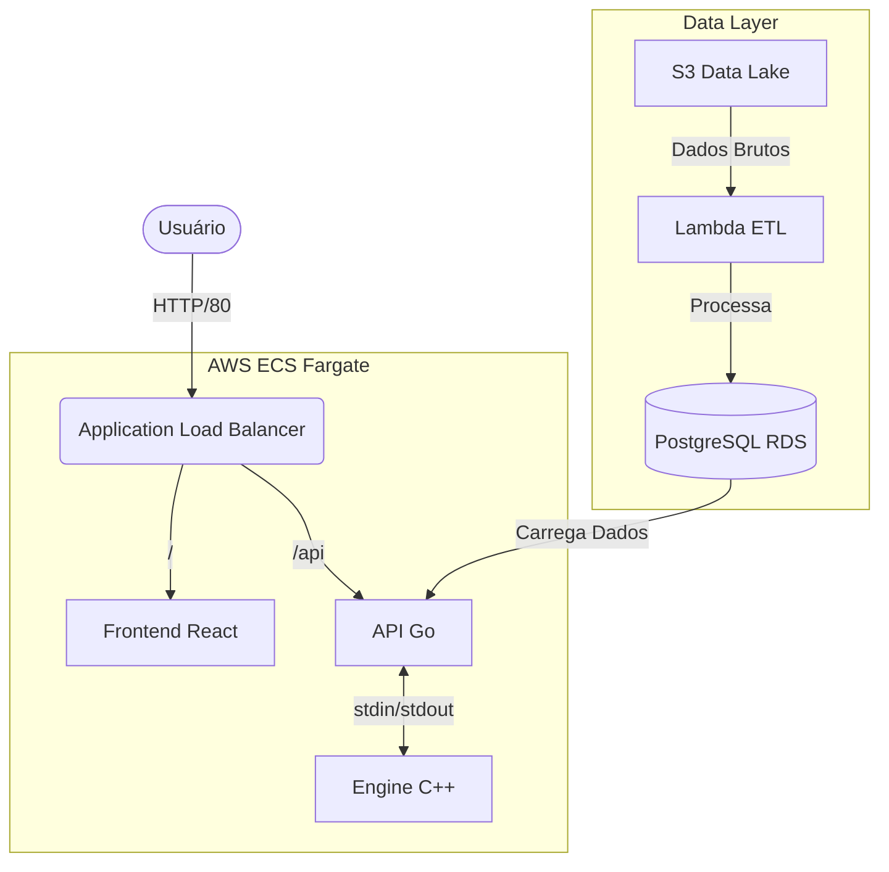
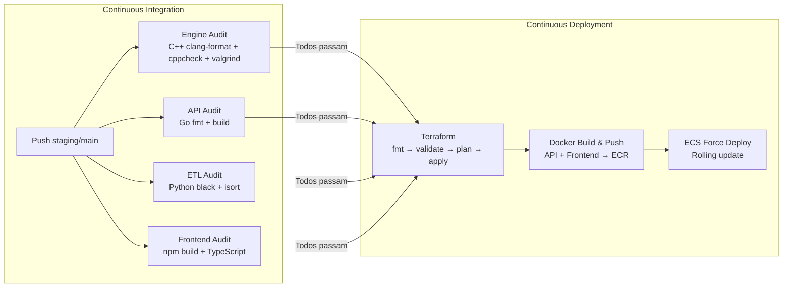

# Nexus SUS Log Engine 🏥🚀

**Nexus SUS** é um sistema de alta performance para ingestão, processamento e visualização de indicadores de saúde do SUS (Sistema Único de Saúde). O projeto utiliza uma arquitetura moderna com **Go**, **C++**, **React**, **AWS Fargate** e **Terraform**.

---

## 🏗️ Arquitetura

O sistema é composto por 4 módulos principais operando na AWS:

1.  **ETL Pipeline (Python/AWS Lambda):** Extrai dados brutos do Data Lake (S3), processa e carrega no banco de dados.
2.  **Core Engine (C++):** Motor de alta performance para indexação e consultas rápidas em memória (Hash Tables & B-Trees).
3.  **API Gateway (Go):** API REST que interage com o Engine e o Banco de Dados.
4.  **Frontend (React/Vite):** Interface de usuário para visualização dos dados.


```mermaid
graph TD
    User([Usuário]) -->|HTTP/80| ALB(Application Load Balancer)
    
    subgraph ECS Cluster [AWS ECS Fargate]
        ALB -->|/| Front[Frontend React]
        ALB -->|/api| API[API Go]
        
        API <-->|stdin/stdout| Engine[Engine C++]
    end
    
    subgraph Data Layer
        ETL[Lambda ETL] -->|Processa| RDS[(PostgreSQL RDS)]
        RDS -->|Carrega Dados| API
        S3[S3 Data Lake] -->|Dados Brutos| ETL
    end
```

---

## 📂 Estrutura do Projeto

| Diretório | Descrição | Tecnologias |
| :--- | :--- | :--- |
| `api/` | API REST principal. Gerencia conexões e o Engine. | **Go (Golang)** |
| `nexus-sus-engine/` | Motor de busca e estrutura de dados em memória. | **C++ (GCC)** |
| `nexus-sus-frontend/` | Interface do usuário (SPA). | **React, Vite, Tailwind** |
| `nexus-sus-etl/` | Scripts de Extração, Transformação e Carga. | **Python 3.11** |
| `infra/` | Infraestrutura como Código (IaC). | **Terraform** |
| `.github/workflows/` | Pipelines de CI/CD para deploy automático. | **GitHub Actions** |

---

## 🚀 Como Rodar Localmente

### Pré-requisitos
*   Docker & Docker Compose
*   Go 1.21+
*   Node.js 18+
*   GCC / G++

### 1. API e Engine
```bash
cd api
go mod tidy
go run main.go
```
*A API tentará iniciar o binário do Engine. Certifique-se de compilar o Engine primeiro em `nexus-sus-engine/`.*

### 2. Frontend
```bash
cd nexus-sus-frontend
npm install
npm run dev
```

### 3. Infraestrutura (Terraform)
```bash
cd infra
terraform init
terraform plan
terraform apply
```

---

## 🛠️ Deployment (CI/CD)

O deploy é totalmente automatizado via **GitHub Actions** para o ambiente de Produção na AWS.

### Pipeline: `deploy-prod.yml`
O workflow é acionado a cada push na `main`:
1.  **Terraform:** Atualiza a infraestrutura (VPC, RDS, ALB, ECS, S3).
2.  **Build & Push:** Compila imagens Docker para API e Frontend e envia para o **Amazon ECR**.
3.  **Deploy:** Atualiza os serviços no **AWS ECS Fargate** com as novas imagens.
4.  **ETL:** Atualiza a função **AWS Lambda** com o código Python mais recente.

---

## 🔌 API Endpoints

### Health Check
`GET /api/health`
Retorna status 200 se a API e o Engine estiverem operacionais.

### Busca de Indicadores
`GET /api/search?uf=SP`
Retorna dados agregados para o estado (UF) solicitado.

**Exemplo de Resposta:**
```json
{
  "uf": "SP",
  "regiao": "Sudeste",
  "valor_uf": 1500.50,
  "valor_regiao": 5000.00,
  "valor_brasil": 20000.00
}
```

---

## 📝 Notas de Desenvolvimento

*   **Engine C++:** Comunica-se com a API Go via `stdin` (entrada de comandos) e `stdout` (saída de logs/dados).
*   **Performance:** O Engine carrega dados críticos na memória RAM para respostas em milissegundos.
*   **Logs:** Todos os logs são enviados para o **Amazon CloudWatch** (`/ecs/nexus-sus-*`).

---

## 🌍 Ambientes

O projeto opera com **dois ambientes isolados** na AWS, cada um com Terraform state separado:

| Ambiente | Branch | State Key | Trigger |
|:--|:--|:--|:--|
| **Staging** | `staging` | `staging/terraform.tfstate` | Push automático |
| **Produção** | `main` | `prod/terraform.tfstate` | Push automático |

### Recursos por Ambiente
Cada ambiente possui instâncias independentes de:
- ECS Cluster, Services e Task Definitions
- RDS PostgreSQL (Multi-AZ)
- ALB + Target Groups
- ECR Repositories (`*-staging` / `*-prod`)
- Lambda ETL
- Security Groups, IAM Roles, KMS Keys

### Variáveis de Ambiente
```bash
TF_VAR_environment=staging  # ou "prod"
TF_VAR_db_username=***      # via GitHub Secrets
TF_VAR_admin_password=***   # via GitHub Secrets
```

---

## 🔒 Segurança

### AWS Secrets Manager
Credenciais do banco **não são passadas em plaintext**. O sistema usa **AWS Secrets Manager** com criptografia via **KMS**:

```
nexus-sus/db-credentials/{environment}
├── username
├── password
├── host
├── port
├── dbname
└── engine
```

- **ECS**: Credenciais injetadas via `secrets` no container definition (resolvidas no boot pelo ECS Agent)
- **Lambda**: Recebe o `SECRETS_ARN` e resolve via `boto3` em runtime

### Princípio de Menor Privilégio (IAM)
| Role | Permissões |
|:--|:--|
| `ecs-task-execution-role` | Pull ECR, CloudWatch Logs, **Secrets Manager read** |
| `ecs-task-role` | CloudWatch Logs |
| `etl-role` | S3 read/write, Lambda VPC, ECR, KMS decrypt |

### Criptografia
- **RDS:** `storage_encrypted = true`
- **Secrets Manager:** Criptografia via KMS (`alias/nexus-sus-lambda-{env}`)
- **Lambda env vars:** Criptografia KMS com key rotation habilitada
- **Terraform State:** `encrypt=true` no backend S3

### Security Groups
```
Internet → ALB (80/443) → Frontend SG (80) → --
                        → API SG (8080)     → RDS SG (5432)
                                            ← Lambda SG (egress only)
```

### HTTPS (Condicional)
O ALB suporta HTTPS quando configurado com certificado ACM:
```hcl
# Em terraform.tfvars ou via variável de ambiente:
acm_certificate_arn = "arn:aws:acm:us-east-1:629614691528:certificate/XXXX"
```
Quando configurado: HTTP/80 → redirect 301 → HTTPS/443 (TLS 1.3).

---

## 📊 Observabilidade

### CloudWatch Logs
Todos os containers enviam logs para grupos dedicados:
- `/ecs/nexus-sus-api-{env}` — Logs da API Go
- `/ecs/nexus-sus-frontend-{env}` — Logs do Frontend

### Container Insights
O ECS Cluster tem **Container Insights habilitado** (`containerInsights = enabled`), fornecendo:
- Métricas de CPU/Memória por service e task
- Métricas de rede e I/O
- Dashboards automáticos no CloudWatch

### Health Checks
**ALB Health Check (Target Group):**
- API: `GET /api/health` (HTTP 200-399, intervalo 30s)

**ECS Container Health Check:**
- API: `curl -f http://localhost:8080/api/health` (intervalo 30s, 3 retries, startPeriod 60s)
- Frontend: `curl -f http://localhost:80/` (intervalo 30s, 3 retries, startPeriod 30s)

### Monitoramento do RDS
- Backup automático com retenção de 1 dia
- Multi-AZ habilitado para alta disponibilidade
- Storage gp3 com criptografia

---

## 🔄 Rollback

### ECS (Containers)
O ECS mantém revisões anteriores das task definitions. Para rollback:
```bash
# Listar revisões disponíveis
aws ecs list-task-definitions --family nexus-sus-api-prod --sort DESC

# Atualizar serviço para revisão anterior
aws ecs update-service \
  --cluster nexus-sus-cluster-prod \
  --service nexus-sus-api-service-prod \
  --task-definition nexus-sus-api-prod:<REVISÃO_ANTERIOR>
```

### Terraform (Infraestrutura)
O pipeline `deploy-prod.yml` faz **backup automático do state** antes de cada apply:
```bash
# Restaurar state do backup
aws s3 cp s3://nexus-sus-terraform-state/prod/terraform.tfstate.backup.<TIMESTAMP> \
         s3://nexus-sus-terraform-state/prod/terraform.tfstate
```

### Lambda ETL
```bash
# Listar versões publicadas
aws lambda list-versions-by-function --function-name nexus-sus-etl-prod

# Lambda layers também possuem versionamento automático
aws lambda list-layer-versions --layer-name nexus-sus-etl-dependencies-prod
```

### Destroy Controlado
O workflow `deploy.yml` possui proteção para destroy:
1. Requer digitação de `DESTRUIR-INFRA-NEXUS-SUS`
2. Ambiente de produção requer aprovação manual via GitHub Environment
3. Aguarda 10 segundos antes de executar

---

## ⚙️ Pipeline CI/CD

### Visão Geral dos Workflows


```mermaid
graph LR
    subgraph CI [Continuous Integration]
        A[Push staging/main] --> B[Engine Audit<br/>C++ clang-format + cppcheck + valgrind]
        A --> C[API Audit<br/>Go fmt + build]
        A --> D[ETL Audit<br/>Python black + isort]
        A --> E[Frontend Audit<br/>npm build + TypeScript]
    end

    subgraph CD [Continuous Deployment]
        B & C & D & E -->|Todos passam| F[Terraform<br/>fmt → validate → plan → apply]
        F --> G[Docker Build & Push<br/>API + Frontend → ECR]
        G --> H[ECS Force Deploy<br/>Rolling update]
    end
```

### Workflows Disponíveis

| Workflow | Arquivo | Trigger | Descrição |
|:--|:--|:--|:--|
| **Unified CI/CD** | `pipeline.yml` | Push `staging`/`main` | Pipeline principal: lint → build → deploy |
| **Production Deploy** | `deploy-prod.yml` | Push `main` | Deploy completo para produção com backup |
| **Infra Deploy** | `deploy.yml` | Manual/workflow_run | Plan/Apply/Destroy controlado |
| **Engine Build** | `compiler.yml` | Push | Build e push do Engine C++ |
| **Frontend Deploy** | `frontend-deploy.yml` | Push | Build e push do Frontend |
| **ETL Pipeline** | `etl_pipeline.yml` | Manual | Executa pipeline ETL Lambda |
| **Terraform Inspect** | `terraform-inspect.yml` | Manual | Inspeciona state do Terraform |
| **Force Cleanup** | `force-cleanup.yml` | Manual | Limpeza forçada de recursos |

### Etapas de Validação (Pipeline Principal)
1. **Lint & Build** — Cada módulo (C++, Go, Python, TypeScript) é validado independentemente
2. **Terraform fmt** — Verifica formatação dos arquivos `.tf`
3. **Terraform validate** — Valida sintaxe e referências da configuração
4. **Terraform plan** — Preview das mudanças na infraestrutura
5. **Terraform apply** — Aplica mudanças aprovadas
6. **Docker build & push** — Constrói e publica imagens no ECR
7. **ECS force deploy** — Atualiza serviços com rolling deployment

### Segurança no Pipeline
- **Concurrency groups** — Evita deploys paralelos no mesmo ambiente
- **Branch protection** — Deploy só de `main`, `staging`, `develop`
- **Secrets isolados** — Credenciais via GitHub Secrets, nunca em código
- **Permissões mínimas** — `contents: read`, `id-token: write`

---

**Desenvolvido com 💙 para o SUS.**
